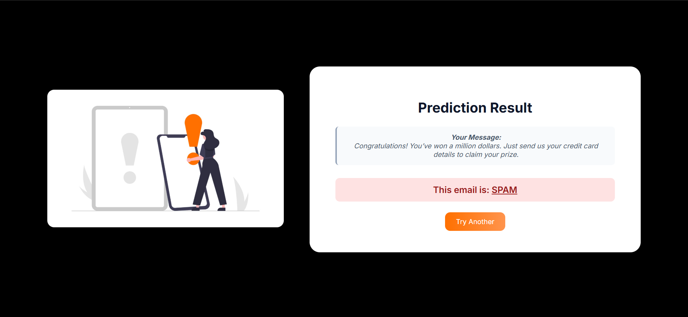
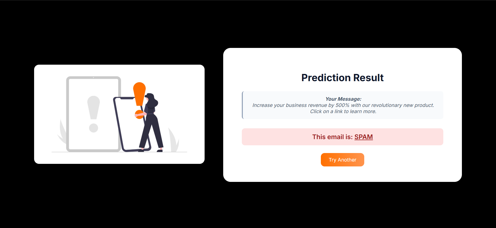

***

<h1 align="center"> ScamDetekt – Spam Email Classifier </h1>

ScamDetekt is an intelligent spam detection web app that classifies email messages as spam or safe in real-time using a machine learning model trained on real-world email data.  
Built as a full-stack data science project, it combines text preprocessing, feature engineering, and classification to deliver accurate and fast predictions through a simple, user-friendly web interface.

***
## Tech Stack

- **Frontend**: HTML, CSS
- **Backend**: Python, Flask Framework
- **ML/NLP**: Scikit-learn, NLTK, TF-IDF, SVM
- **Model Storage**: Pickle (`.pkl` files)

## Features

**Spam Detection Using Machine Learning**

- ScamDetekt uses a trained Support Vector Machine (SVM) model to classify email messages as either spam or safe with high accuracy.

**Text Preprocessing**

- The input text is cleaned using lowercasing, punctuation removal, stopword filtering via NLTK to improve classification performance.

**TF-IDF Feature Engineering**

- Emails are converted into meaningful numerical vectors using TF-IDF vectorization with unigrams and bigrams, limited to top 3000 features.

**Multiple Classifier comparison**

- A variety of models (Logistic Regression, Naive Bayes, Random Forest, etc.) were evaluated and compared before finalizing the best performer.

*Classifier Performance Comparison*

<table style="font-size: 0.75rem; border-collapse: collapse;">
  <thead>
    <tr>
      <th>#</th>
      <th>Model</th>
      <th>Accuracy</th>
      <th>Spam Precision</th>
      <th>Spam Recall</th>
      <th>Spam F1-Score</th>
    </tr>
  </thead>
  <tbody>
    <tr><td>1</td><td>K-Nearest Neighbors</td><td>0.942</td><td>0.99</td><td>0.57</td><td>0.73</td></tr>
    <tr><td>2</td><td>Bagging Classifier</td><td>0.964</td><td>0.91</td><td>0.81</td><td>0.86</td></tr>
    <tr><td>3</td><td>AdaBoost Classifier</td><td>0.967</td><td>0.93</td><td>0.81</td><td>0.87</td></tr>
    <tr><td>4</td><td>Gradient Boosting</td><td>0.960</td><td>0.96</td><td>0.73</td><td>0.83</td></tr>
    <tr><td>5</td><td>Extra Trees Classifier</td><td>0.975</td><td>0.98</td><td>0.83</td><td>0.90</td></tr>
    <tr><td>6</td><td>Random Forest Classifier</td><td>0.977</td><td>0.97</td><td>0.85</td><td>0.91</td></tr>
    <tr><td>7</td><td>Decision Tree Classifier</td><td>0.956</td><td>0.83</td><td>0.85</td><td>0.84</td></tr>
    <tr><td>8</td><td>Passive Aggressive</td><td>0.977</td><td>0.92</td><td>0.90</td><td>0.91</td></tr>
    <tr><td>9</td><td>Ridge Classifier</td><td>0.979</td><td>0.93</td><td>0.91</td><td>0.92</td></tr>
    <tr><td>10</td><td>Linear SVM</td><td>0.978</td><td>0.93</td><td>0.91</td><td>0.92</td></tr>
    <tr><td>11</td><td>Logistic Regression</td><td>0.974</td><td>0.89</td><td>0.92</td><td>0.90</td></tr>
    <tr><td>12</td><td>Multinomial Naive Bayes</td><td>0.978</td><td>0.96</td><td>0.87</td><td>0.92</td></tr>
  </tbody>
</table>

- Higher precision reduces false positives (good for spam), while higher recall ensures actual spam is caught. SVM, Ridge, and Naive Bayes strike the best balance.

**Interactive Web Interface**

- Built with Flask and Jinja2 templates, the app provides a minimal and elegant UI to input email content and view results instantly.

**Dynamic Prediction Output**

- After submitting a message, the user is shown whether their email is spam or safe, along with message display.

**Model Persistence with Pickle**

- The trained model and vectorizer are serialized with `.pkl` files and reused during prediction, making the app fast and efficient.

**Clean Code & Modular Structure**

- Clear separation of training logic (train_model.py), backend app logic (app.py), and templates/static files ensures maintainability.

***

## UI

<table>
  <tr>
    <td align="center">
      <strong>Example</strong>
    </td>
    <td align="center">
      <strong>Predicted Result</strong>
    </td>
  </tr>
  <tr>
  <tr>
    <td align="center">
       
    </td>
    <td align="center">
       
    </td>
  </tr>
  <tr>
    <td align="center">
       
    </td>
    <td align="center">
       
    </td>
  </tr>
  <tr>
    <td align="center">
       
    </td>
    <td align="center">
       
    </td>
  </tr>
</table>

***
This project is licensed under the [MIT License](LICENSE).

***
